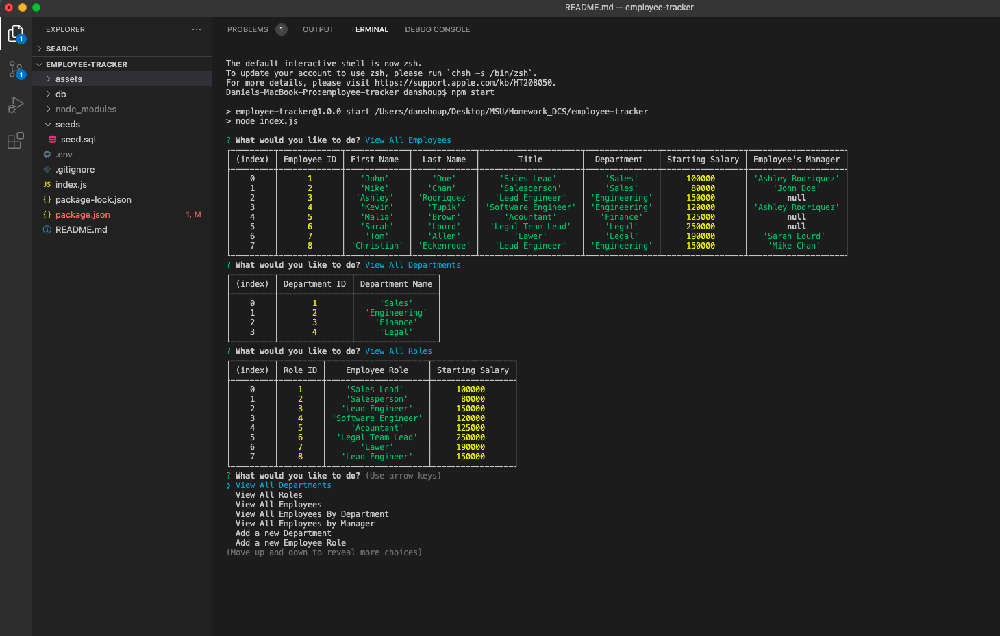

# 12 MySQL

## Creating a Employee Tracker

This is the twelfth assignment for the MSU Coding Bootcamp; to create a terminal application that uses inquirer to prompt user for input about a company's employee data. 

### Live Links
- [Daniel Shoup's Employee Tracker Repisitory](https://github.com/danshoup/employee-tracker)
- [Daniel Shoup's Employee Tracker Demo Video](https://drive.google.com/file/d/1cML5Q4WD4BydRcCv8aUkGfHoyEgE56Nw/view)

### Note Taker Screenshot

## Acceptance Criteria

- The application will use node, inquirer, and MySQL.

- Database schema contains the following three tables: employee - id, first_name, last-name, role_id, manager_id; role - id, title, salary, department_id; department - id, name.

- ID is the primary key on all tables. department_id, role_id, and manager_id are FOREIGN KEYS.

- Command-line application allows user to add departments, roles, and employees.

- Command-line application allows user to view departments, roles, and employees.

- Command-line application allows user to update employee roles.

- GitHub URL must be submitted, and the repository must contain the application code.

- Application console is free of errors.

- Repository has a unique name and follows best practices for naming, indentation, comments, and contains descriptive commit messages.  The repository also contains a quality READMY file with description, screenshot,a nd link to deployed application.

- BONUS: Application allows users update employee manager, vew employees by manager, delete departments, roles, and employees, and view total budget of a department.

- URL of the GitHub repository, and a linkd to a demmo video of the application must be submitted.

